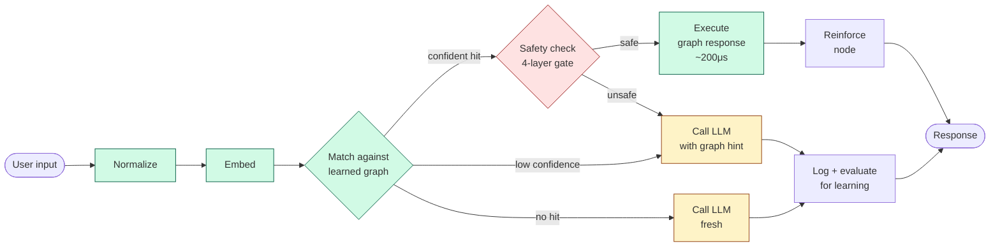
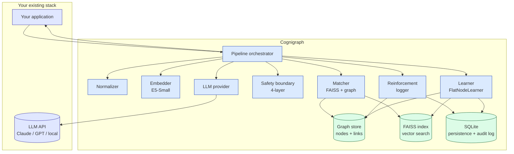

# Cognigraph

**A runtime cognitive coordination layer that transforms AI reasoning into adaptive enterprise execution.**

Cognigraph sits between an LLM and the system that needs to act on its output. It coordinates four concerns most products conflate — *routing, safety, reinforcement, learning* — so the head of your query distribution gets handled deterministically at sub-millisecond latency, the tail goes to the LLM, and both are auditable.

> Status: open-source reference implementation. Architecture ships, integrations + benchmarks coming. Not a product yet — looking for design partners and feedback. See [Project Status](#project-status).

---

## The shape of the problem

Every LLM-using product re-pays for the same questions, every time. A 200-agent customer-support team handles 50,000 tickets/month — 80% of them are some shape of "how do I reset my password" or "where's my order." Each one: full token spend, ~800ms of latency, a non-deterministic answer that audit can't reproduce. Multiply across the industry and it's billions of dollars and millions of seconds spent re-deriving the same answers.

This isn't a caching problem and it isn't a fine-tuning problem.

- **Caching** (GPTCache, semantic caches) is passive lookup. No safety, no composition, no confidence calibration, no decay. Serve a stale answer to a regulated query and you have a compliance incident.
- **Fine-tuning** bakes patterns into opaque model weights. Can't audit, can't selectively unlearn, can't update incrementally. Your competence becomes a vendor's checkpoint.
- **RAG** grounds the LLM in documents. Useful, but every query still pays the full LLM round-trip. RAG and Cognigraph are complementary — RAG handles knowledge-grounded freeform Q&A; Cognigraph handles the head-heavy repetition.
- **Rule-based chatbots** are deterministic and rigid. New patterns require manual authoring; the system doesn't learn.

The missing layer is one that **learns from LLM experience, gates execution by safety, and coordinates which path each request takes**. That's what Cognigraph is.

---

## How it works



Per request, Cognigraph:

1. **Normalizes + embeds** the input.
2. **Matches** against a learned graph of habit-nodes via FAISS.
3. **Routes** one of four ways: `GRAPH_DIRECT` (confident, leaf), `GRAPH_COMPOSED` (confident, multi-step), `LLM_FALLBACK` (some signal, escalate with hint), `LLM_ONLY` (novel, escalate fresh).
4. **Safety-gates** before any graph route fires: high-risk → escalate, volatile → escalate, ambiguous match → escalate, blocklisted pattern → escalate.
5. **Reinforces** the matched node on graph routes (confidence ↑, stability tier promotion at 5 / 20 reinforcements).
6. **Logs every interaction** to SQLite — auditable to the row.
7. **Evaluates for learning**: when 3+ similar inputs get stable LLM responses, a new habit-node crystallizes automatically. Subsequent matching queries route through the new node at zero token cost.

The graph **starts empty**. It grows from experience. Unused habits decay. The system gets faster and cheaper the longer it runs on a real workload.

---

## What you get

| Capability | Why it matters for enterprise |
|---|---|
| **Sub-millisecond on the head** | Graph hits ~200μs vs LLM round-trip ~500-2000ms. |
| **Zero token cost on learned queries** | After 3 stable answers, the LLM is no longer in the loop for that intent. |
| **4-layer safety boundary** | Risk gating, volatility flag, ambiguity detection, pattern blocklist — fires *before* any graph route executes. By design, the graph cannot confidently serve a dangerous, stale, ambiguous, or blocklisted answer. |
| **Auditable to the row** | Every habit traces to specific `interaction_log` rows in SQLite. "Why did your AI tell that customer this?" → SQL query. |
| **Learns and forgets** | Stable repeated patterns crystallize into nodes; unused nodes decay. The graph self-prunes; doesn't grow unbounded. |
| **Composable skills** | Linked nodes form multi-step procedures. Skill chains execute as a unit. |
| **Vendor-neutral** | Every component (LLM, embedder, vector index, persistence) is behind a runtime-checkable Protocol. Swap Claude for GPT for a local model — the rest of the system doesn't notice. |
| **Local-first** | SQLite + FAISS + sentence-transformers all run in-process. The LLM is the only external dependency. Deploy in your VPC, no data leaves it. |

---

## Concrete enterprise scenario: customer support deflection

A SaaS company's support team:

| Variable | Value |
|---|---|
| Agents | 200 |
| Tickets per month | 50,000 |
| Average LLM cost per ticket (current) | $0.04 |
| Average LLM latency per ticket | 800ms |
| **Monthly LLM spend (today)** | **$2,000** |
| **Annual LLM spend (today)** | **$24,000** |

Their ticket distribution is head-heavy: ~80% of tickets are some shape of 30 common questions (reset password, where's my refund, change shipping address, etc.).

After deploying Cognigraph in front of their LLM:

| Variable | Value |
|---|---|
| Tickets routed to graph (deflection rate) | 80% (40,000/month) |
| LLM cost on deflected tickets | $0 |
| LLM latency on deflected tickets | <1ms |
| Tickets still hitting LLM | 20% (10,000/month) |
| **Monthly LLM spend** | **$400** |
| **Annual LLM spend** | **$4,800** |
| **Annual savings** | **$19,200 (80%)** |
| **Tail latency on deflected tickets** | **800ms → <1ms** |

Same architecture, more concretely:

- **Week 1**: agents handle tickets normally; Cognigraph observes. Most queries route LLM_ONLY; the LLM does its job, every interaction is logged.
- **Week 2**: common patterns cross the 3-rep threshold. Habit-nodes crystallize automatically. The same questions now route LLM_FALLBACK (existing node + graph context to LLM).
- **Week 4**: confident habit-nodes promote to GRAPH_DIRECT. Now the LLM is no longer called for those queries. Graph hit rate climbs past 50%.
- **Month 3**: graph hit rate stabilizes at 70-85% on common queries. Unused habits decay. New patterns continue to crystallize.

What survives a regulator asking "why did your system tell this customer X":

```sql
SELECT * FROM interaction_log
WHERE matched_node_id = 'pwd-reset-confident'
  AND timestamp BETWEEN '2026-01-01' AND '2026-12-31';
```

Every row is the input, the route decision, the matched node, the response served, the LLM response (if any), and the latency.

This is the wedge. Other verticals (internal IT, codebase-specific developer tools, voice/edge agents, regulated chatbots) follow the same pattern — head-heavy distribution + cost + audit pressure + a need for sub-LLM-latency on the head.

---

## Where Cognigraph fits

**Strong fit**

- Customer support / help desk — head-heavy ticket distribution, cost pressure, audit needs
- Internal IT (password resets, VPN setup, expense workflows)
- Codebase-specific developer assistants — captures team conventions over time
- Voice / smart-home / edge agents — latency-sensitive, can't afford LLM round-trip
- Regulated chatbots (banking, healthcare, legal) — auditable deterministic responses on the head, logged LLM fallback on the tail
- Multi-tenant SaaS — each tenant's pipeline learns their patterns; data isolation by design

**Weak fit**

- Highly novel / freeform tasks (creative writing, exploratory analysis) — every input is unique; the graph never learns
- Cold-start scenarios with no learning history — Cognigraph adds overhead with no benefit until patterns repeat
- Knowledge-base Q&A over fast-changing documents — that's a RAG problem, not a habit-formation problem

---

## Architecture



Every component is behind a runtime-checkable Python `Protocol` — designed for cross-language portability. The whole graph store can be swapped for a Postgres-backed implementation; the LLM can be swapped between Claude / GPT / a local model; the embedder can be swapped between E5 / BGE / OpenAI's ada-3; nothing else has to change.

See [`docs/architecture.md`](docs/architecture.md) for the deeper explanation, and [`itds/`](itds/) for the architectural decision records.

---

## Comparison

| Capability | Raw LLM | Semantic cache (GPTCache) | RAG (LlamaIndex/LangChain) | Fine-tune | Rule-based chatbot | **Cognigraph** |
|---|:---:|:---:|:---:|:---:|:---:|:---:|
| Handle any input | ✅ | partial | ✅ | partial | ❌ | ✅ |
| Sub-millisecond on the head | ❌ | ✅ (cache hit) | ❌ | ❌ | ✅ | ✅ |
| Learn from interactions | ❌ | ❌ | ❌ | offline only | ❌ | ✅ |
| Multi-step skills emerge | ❌ | ❌ | ❌ | partial | hand-built | ✅ |
| Audit trail | ❌ | ❌ | ❌ | ❌ | ✅ | ✅ |
| Safety boundary on cached answers | ❌ | ❌ | ❌ | ❌ | ✅ | ✅ |
| Forget unused knowledge | ❌ | TTL/LRU | ❌ | ❌ | ❌ | ✅ |
| Per-user / per-tenant learning | ❌ | partial | ❌ | retraining | ❌ | ✅ |
| Vendor-neutral | ❌ | ❌ | ❌ | ❌ | ✅ | ✅ |

---

## Project status

**Pre-MVP — architectural risk retired, adoption infrastructure in progress.**

| Shipped | Open |
|---|---|
| Embedding service (E5-Small, lazy-loaded, L2-normalized) | Lifecycle (load/save/SIGINT) |
| In-memory graph store (Protocol-driven, O(1) lookup) | REPL / CLI |
| SQLite persistence (WAL mode, schema versioning, audit log) | Child execution (composed skills) |
| FAISS vector index (atomic save, NaN/zero rejection, close()) | Response formatter |
| Claude API client (retriable/permanent error subclasses) | Working memory / session context |
| Node matcher (4-way routing, ambiguity detection) | Link detection (auto-discover sequences) |
| Reinforcement logger (count, confidence, stability tiers) | Decay (cognitive eviction) |
| Flat node creation / learner (3-rep cluster crystallization) | Benchmarks (vs GPTCache, raw LLM) |
| Safety boundary (4-layer gate, observability counters) | Integration adapters (LangChain, LlamaIndex) |
| Pipeline integration (process() entry point) | Multi-tenant isolation |

**527 tests passing** (unit + e2e using real E5 embeddings, real FAISS, real SQLite, real or fake-anthropic LLM). Architect-reviewed at every step with rigorous BLOCK / WARN / NOTE discipline; all BLOCKs and important WARNs resolved inline; lower-priority items filed as tracked follow-ups.

The architecture is settled. The remaining engineering work is adoption infrastructure (benchmarks, integrations, observability hooks, multi-tenant), not core architecture.

---

## What I want from you

Three asks, in priority order:

1. **Feedback.** Is the problem real for you? Is "runtime cognitive coordination layer" a category that fits a need on your product roadmap? Where does the pitch fall apart?
2. **Design partnership.** If you have a head-heavy LLM workload — customer support, internal tools, agentic flows that touch the same intents repeatedly — I'd like to deploy a pilot, run it on your real distribution, and publish the cost-and-latency numbers together. The case study is worth more than your engineering time.
3. **Pilot deployment.** If you're already in design-partner conversation, the next step is a fixed-scope, fixed-timeline pilot in your environment. You keep the graph and the data regardless of outcome.

Not asking for funding. Funding follows belief.

---

## Quick start (post-MVP — issue #20 + #21)

```bash
# Install
uv sync

# Run the smoke runner with a mocked LLM (no API key needed)
uv run python scratch/run_smoke.py

# Run the full test suite (527 tests, ~30s)
uv run pytest

# When #20 + #21 land:
ANTHROPIC_API_KEY=sk-... uv run cognigraph
```

The smoke runner (`scratch/run_smoke.py`) demonstrates the full lifecycle without an API key: cold start → 3 repetitions → habit crystallizes → subsequent queries route through the graph. ~3 seconds end-to-end.

---

## Tech stack

| Component | Choice |
|---|---|
| Language | Python 3.12+ |
| Package manager | uv |
| Embedding model | sentence-transformers (E5-Small, 384 dims) |
| Vector search | FAISS (`IndexFlatIP`) |
| Storage | In-memory dicts (hot path) + SQLite (persistence + audit) |
| LLM | Anthropic Claude (vendor-neutral via `LLMProvider` protocol) |
| Testing | pytest |

See [ITD: Language and Stack Selection](itds/ITD_2026-03-11_language-and-stack-selection.md) for the full rationale.

---

## Contact

- **Repo**: github.com/ibrahim-bayer/cognigraph-ai
- **Website**: [ibgroup.dev](https://ibgroup.dev)
- **Issues**: [open an issue](https://github.com/ibrahim-bayer/cognigraph-ai/issues) for bug reports, feature requests, or to discuss design-partner conversations

## License

TBD — will be determined before first usable release. The intent is to be open source.

---

## Inspiration

The mechanism mirrors basal-ganglia / striatal procedural memory in neuroscience: routine decisions execute through a learned, gated, decay-pruned circuit; novel decisions escalate to cortex. Daniel Kahneman's *Thinking, Fast and Slow* (System 1 / System 2) is the same idea at a different level of description. These are the engineering metaphors — the public positioning is "runtime cognitive coordination layer."
