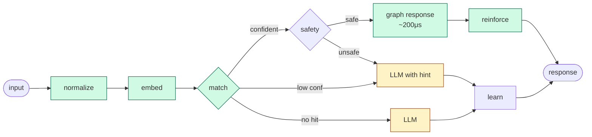
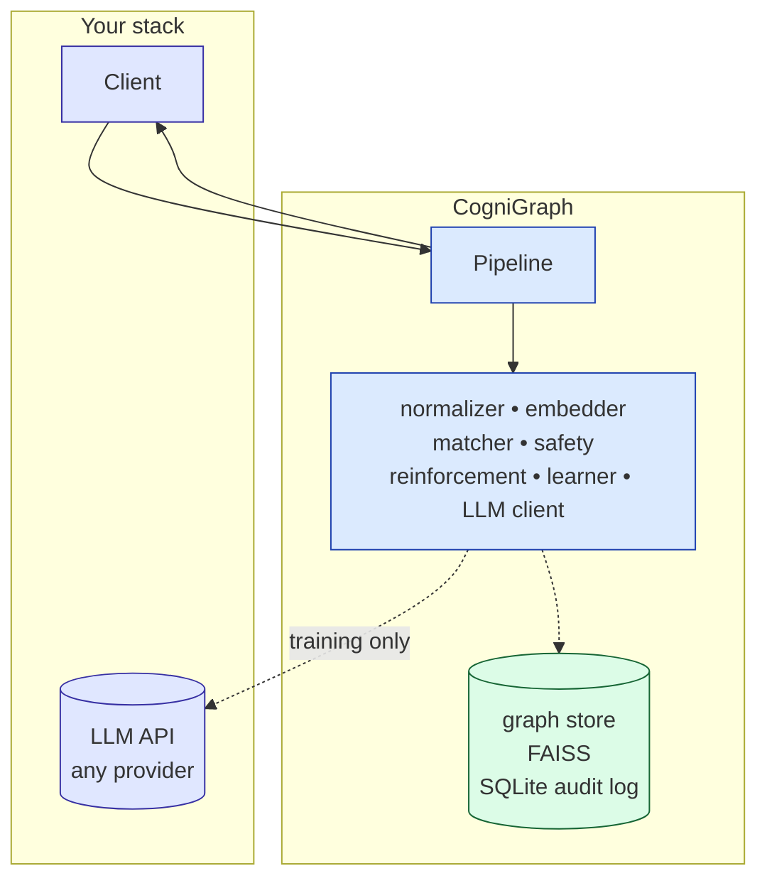

# CogniGraph

## Automate without coding. Build without knowing.

AI is the gateway. CogniGraph is the cognitive runtime.

You don't write the automation. You don't fine-tune a model. You describe what should happen to an AI, and CogniGraph crystallizes the AI's stable responses into a graph of inspectable habits. After enough learning, the graph runs the system on its own — with **the AI no longer in the loop**.

> **Train with AI. Deploy without it.**

This is the post-software paradigm. Every previous generation of automation made you say what the system should do, in advance, in some formal language — code, prompts, training data, decision trees. CogniGraph is the first runtime where you can teach by example, audit what was learned, and run forever without the teacher.

> Status: open-source reference implementation. 548 tests passing, architectural risk retired. Looking for design partners and feedback — not funding.

---

## The shift

| Era | What you write | What automates |
|---|---|---|
| **Software** | code | deterministic execution |
| **AI** | prompts | non-deterministic generation, every call |
| **Cognitive (CogniGraph)** | *nothing* — train through use | auditable runtime, deployable without the AI |

The first two require knowing in advance what you want. CogniGraph lets the system **learn what you want from AI interactions, capture it as cognition, and operate from cognition alone once trained.**

---

## Why "deploy without it" is the moat

After training, no other approach lets you operate with zero ongoing AI dependency:

| | Can deploy without an LLM at runtime? |
|---|:---:|
| Raw LLM | ❌ |
| Semantic cache (GPTCache) | ❌ — empty without an LLM populating it |
| RAG (LangChain, LlamaIndex) | ❌ — every query calls the LLM |
| Fine-tuned model | partial — replaced one model dependency with another |
| Rule-based chatbot | ✅ but no learning; you wrote every rule |
| **CogniGraph** | ✅ **and the training is automated** |

This is what unlocks deployments that "AI infrastructure" can't reach:

- **AI sovereignty** — no vendor API at runtime. No rate limits, surprise pricing, deprecated models, or vendor lock-in.
- **Air-gapped / sovereign cloud** — defense, intelligence, banking, healthcare. Train in the cloud, deploy in a SCIF.
- **Edge / embedded** — robotics, IoT, vehicles, factory floors. Train once, ship a chip.
- **Compliance hard mode** — every decision traces to a database row. Behavior is deterministic. No external dependency to certify.
- **Cost goes to zero, not just down** — at steady state, marginal cost per request is energy and storage. No tokens.

---

## How it works



Per request:

1. **Normalize → embed → match** against a learned graph via FAISS
2. **Safety-gate** before any graph route fires (4-layer: risk / volatility / ambiguity / blocklist)
3. **Route**: graph-direct (confident leaf), graph-composed (skill chain), LLM-fallback (graph hint to LLM), LLM-only (novel)
4. **Reinforce** matched nodes; **log** every decision; **evaluate for learning** — three stable LLM responses to similar inputs crystallize a new node automatically

The graph **starts empty**. It grows from observed AI experience. Unused habits decay. The system gets faster and cheaper the longer it runs on a real workload — and at saturation, the LLM can be unplugged.

---

## Cognitive properties

CogniGraph models four properties most automation lacks:

| Property | What it does |
|---|---|
| **Procedural memory** | Repeated stable behavior crystallizes into a habit-node — the AI's answer becomes a database row, inspectable as text. |
| **Safety inhibition** | A 4-layer boundary (risk / volatility / ambiguity / blocklist) refuses to fire on dangerous, stale, or ambiguous inputs. |
| **Reinforcement** | Habits that succeed strengthen. Habits that fail snap back to LLM-dependent. |
| **Decay** | Unused habits fade. The graph self-prunes. |

Auditable, local-first, vendor-neutral. Every learned behavior is inspectable text — not opaque weights, not a vendor's logs.

---

## Architecture



Every component is behind a runtime-checkable Python `Protocol` — designed for cross-language portability. Swap the LLM, embedder, vector index, or persistence backend without touching anything else.

See [docs/architecture.md](docs/architecture.md) for the deep reference and [itds/](itds/) for architectural decision records.

---

## Comparison

| Capability | Raw LLM | GPTCache | RAG | Fine-tune | Rule-based | **CogniGraph** |
|---|:---:|:---:|:---:|:---:|:---:|:---:|
| Sub-millisecond on the head | ❌ | ✅ | ❌ | ❌ | ✅ | ✅ |
| Learn from interactions | ❌ | ❌ | ❌ | offline | ❌ | ✅ |
| Multi-step skills | ❌ | ❌ | ❌ | partial | hand-built | ✅ |
| Audit trail | ❌ | ❌ | ❌ | ❌ | ✅ | ✅ |
| Safety boundary on cached answers | ❌ | ❌ | ❌ | ❌ | ✅ | ✅ |
| Self-pruning | ❌ | TTL/LRU | ❌ | ❌ | ❌ | cognitive decay |
| **Deploy without an LLM** | ❌ | ❌ | ❌ | partial | ✅ | ✅ |
| Vendor-neutral | ❌ | ❌ | ❌ | ❌ | ✅ | ✅ |

---

## Use cases

The pattern fits any operational domain where:
- a finite set of intents dominates (head-heavy distribution)
- determinism on the head matters more than creativity
- latency, audit, or sovereignty constraints rule out per-call LLM dependency

Strong fits: customer support deflection, internal IT helpdesk, codebase-specific developer assistants, voice / smart-home / edge agents, regulated chatbots, robotics command sets, multi-tenant SaaS.

Weak fits: highly novel / freeform tasks, single-shot interactions, fast-changing knowledge bases (RAG territory).

---

## Status

| Shipped | Next |
|---|---|
| Embedding service | REPL / CLI (#21) |
| Graph store | Benchmarks vs raw LLM, GPTCache |
| SQLite persistence + audit log | Integration adapters (LangChain, LlamaIndex) |
| FAISS vector index | Multi-tenant isolation |
| LLM client (Claude) | Composed skill execution (#11) |
| Matcher (4-route decision) | Decay / eviction (#17) |
| Reinforcement logger | Observability hooks (#28) |
| Learner (3-rep crystallization) | |
| Safety boundary (4-layer) | |
| Pipeline orchestrator | |
| Application lifecycle | |

**548 tests** unit + e2e using real E5 embeddings, real FAISS, real SQLite. Architect-reviewed at every step; all BLOCKs and important WARNs resolved inline.

---

## Try it

```bash
uv sync
uv run python scratch/run_smoke.py    # offline demo, no API key, ~3s
uv run pytest                          # full suite, ~20s
```

`scratch/run_smoke.py` is the reproducible cold-start-to-confident demo: 6 distinct intents trained from a mocked LLM, learner crystallizes them, smoke runner validates routing across all four route decisions and across a close-and-reopen cycle.

---

## Asks

In priority order:

1. **Feedback** — is the category real for you? Where does the pitch fall apart?
2. **Design partnership** — bring a real workload; we'll deploy a pilot and publish the deflection / cost / latency numbers together
3. **Pilot** — fixed scope, fixed timeline, you keep the data and the graph regardless

Not asking for funding. Funding follows belief.

[Open an issue](https://github.com/ibrahim-bayer/cognigraph-ai/issues) or DM if any of this fits a problem you're trying to solve.

---

## Tech

Python 3.12+ · uv · sentence-transformers (E5-Small) · FAISS · SQLite · Anthropic Claude (vendor-neutral via `LLMProvider` protocol)

Repo: github.com/ibrahim-bayer/cognigraph-ai · Site: [ibgroup.dev](https://ibgroup.dev)

License: TBD (intent: open source) before first usable release.

---

*The architecture mirrors basal-ganglia / striatal procedural memory and Kahneman's System 1 / System 2 — used as engineering reasoning, not public positioning.*
