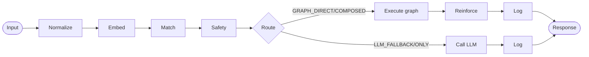
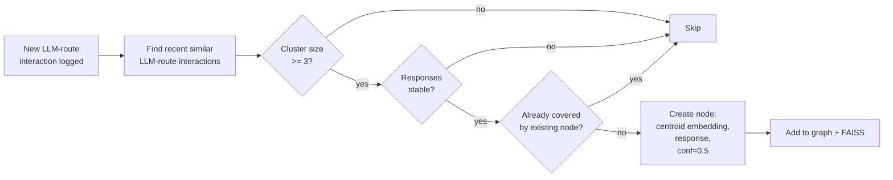
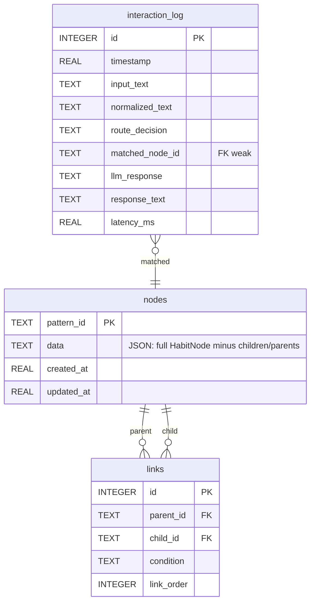

# Architecture

**Cognigraph is a runtime cognitive coordination layer that transforms AI reasoning into adaptive enterprise execution.**

This document describes how that promise is decomposed into components, what invariants each component holds, and how they interact at request time.

For the strategic framing and use cases, see [README.md](../README.md). For specific architectural decisions and their rationale, see [`itds/`](../itds/).

---

## Two-loop model

Cognigraph runs two loops at different speeds.

### Hot loop (per request, sub-millisecond on the head)



Every request goes through the same five-component pipeline:

1. **Normalize** — canonicalize input (whitespace, unicode NFKC, control chars, length cap)
2. **Embed** — produce a 384-dim L2-normalized vector via E5-Small
3. **Match** — FAISS top-k against the graph; rank by `similarity × node.confidence`; return matched node + route decision
4. **Safety** — 4-layer gate: risk / volatility / ambiguity / blocklist. Can override the matcher's route.
5. **Execute** — graph routes return the matched node's response; LLM routes call the configured `LLMProvider`.

After execution:

6. **Reinforce** — graph routes increment the matched node's reinforcement count, boost confidence, snap stability tiers
7. **Log** — every interaction lands in SQLite as one row in `interaction_log` (audit trail)
8. **Evaluate for learning** — see warm loop below

### Warm loop (per LLM-route turn, eventually background)

When an LLM route fires, the learner inspects the recent interaction history. If three or more recent interactions cluster on similar inputs with stable responses, the learner crystallizes a new graph node:



The crystallized node has `confidence=0.5` (below the matcher's confidence threshold of 0.7), so the next matching query routes `LLM_FALLBACK` — the LLM still answers, but with the graph hit as context. After enough confident reinforcements (~10 hits crossing the threshold), the route shifts to `GRAPH_DIRECT` and the LLM is no longer in the loop for that intent.

This is the **learning loop**: cold start → LLM_ONLY → cluster crystallizes → LLM_FALLBACK with hint → reinforcement → GRAPH_DIRECT.

---

## Component layout

```
cognigraph
├── pipeline.py        # Orchestrator — single process() entry point
├── normalizer.py      # Input canonicalization
├── embedding.py       # E5-Small wrapper (EmbeddingProvider)
├── graph_store.py     # In-memory dicts (GraphStoreProtocol)
├── vector_index.py    # FAISS wrapper (VectorIndexProtocol)
├── persistence.py     # SQLite + audit log (PersistenceProtocol)
├── llm_client.py      # Claude API (LLMProvider)
├── matcher.py         # 4-way routing decision (NodeMatcherProtocol)
├── safety.py          # 4-layer boundary (SafetyBoundaryProtocol)
├── reinforcement.py   # Hit counters, confidence, stability tiers
├── learner.py         # Cluster detection, dedup, node creation
├── models.py          # Data classes (HabitNode, MatchResult, ...)
├── protocols.py       # All component contracts
├── config.py          # Tunable thresholds
└── exceptions.py      # Error hierarchy
```

Every component depends on a Protocol, not a concrete class. The default constructor builds a real production stack; tests inject fakes via constructor kwargs.

---

## Data model

### `HabitNode`

The core learned unit. Stored in-memory in `InMemoryGraphStore`, persisted as JSON in SQLite.

```python
HabitNode(
    pattern_id: str,            # UUID
    trigger_patterns: list[str], # input texts that crystallized this node
    embedding_vector: list[float], # centroid of the cluster, unit-length
    confidence: float,           # 0.5 starting; +0.02 per reinforcement; capped at 1.0
    reinforcement_count: int,    # 0 → 5 (MEDIUM) → 20 (HIGH) stability tiers
    last_used_at: float,
    decay_score: float,          # for future #017 decay loop
    stability: Stability,        # LOW / MEDIUM / HIGH
    risk_level: RiskLevel,       # LOW / MEDIUM / HIGH (HIGH escalates via safety)
    volatile: bool,              # True → always escalates (e.g., "what time is it")
    response_form: ResponseForm, # FIXED / TEMPLATE / PROCEDURAL
    response: str,               # the answer to serve
    children: list[ChildLink],   # composed-skill children (deferred to #011)
    parents: list[str],          # for graph traversal
    is_composed: bool,
    sequence_position: int | None,
)
```

### `RouteDecision`

```python
class RouteDecision(str, Enum):
    GRAPH_DIRECT = "graph_direct"      # confident leaf node, return response
    GRAPH_COMPOSED = "graph_composed"  # confident root with children, walk chain
    LLM_FALLBACK = "llm_fallback"      # graph hit but not confident, LLM with hint
    LLM_ONLY = "llm_only"              # no useful graph hit, fresh LLM call
```

### `MatchResult`

What the matcher returns:

```python
MatchResult(
    node: HabitNode | None,
    score: float,           # combined sim × conf, clamped [0, 1]
    similarity: float,      # raw cosine, clamped [0, 1]
    route_decision: RouteDecision,
    candidates: list[(NodeId, float)],  # top-k FAISS hits for the learner
    ambiguous: bool,        # top-2 combined-score gap < ambiguity_gap
)
```

### `SafetyDecision`

```python
SafetyDecision(
    safe: bool,
    reason: str | None,            # "high_risk_node", "blocklist_match", ...
    override_route: RouteDecision | None,  # what the pipeline should use instead
)
```

### `InteractionLog`

The audit-trail row, persisted to SQLite per turn:

```python
InteractionLog(
    timestamp: float,
    input_text: str,           # raw input
    normalized_text: str,
    route_decision: RouteDecision,  # EFFECTIVE route after safety override
    matched_node_id: str | None,    # matcher's hit (preserved even if safety overrode)
    llm_response: str | None,
    response_text: str,        # what was returned to the user
    latency_ms: float,
)
```

### `PipelineResult`

What `pipeline.process()` returns:

```python
PipelineResult(
    response: str,
    route: RouteDecision,
    matched_node_id: str | None,
    latency_ms: float,
    confidence: float,
    reason: str | None,        # safety override reason, if any
)
```

---

## Routing decision in detail

The matcher applies a strict-inclusive threshold ladder against the top-1 candidate's `(similarity, confidence)`:

```python
if similarity < fallback_similarity:        # default 0.6
    return LLM_ONLY
elif similarity >= similarity_threshold and confidence >= confidence_threshold:
    return GRAPH_COMPOSED if has_children else GRAPH_DIRECT
else:
    return LLM_FALLBACK  # weak band or strong-sim-weak-conf
```

Defaults: `similarity_threshold=0.85`, `confidence_threshold=0.7`, `fallback_similarity=0.6`. Configurable per deployment.

The combined score (`similarity × confidence`) is used only for **ranking** candidates, not routing. Routing is re-evaluated against the winner's raw `(sim, conf)` so the ranking heuristic doesn't propagate into route decisions.

---

## Safety boundary

The boundary applies four checks in order, fail-safe to the LLM:

1. **Blocklist (route-agnostic)** — case-insensitive substring match against the input text. Pattern hits force LLM_FALLBACK (or LLM_ONLY if no node was matched).
2. **Risk gating (graph routes only)** — `node.risk_level == HIGH` → escalate to LLM_FALLBACK.
3. **Volatile (graph routes only)** — `node.volatile == True` → escalate (used for time-sensitive intents like "what time is it").
4. **Ambiguity (graph routes only)** — `match_result.ambiguous == True` (matcher's top-2 combined-score gap < `ambiguity_gap`) → escalate.

If `safety.check()` itself raises, the pipeline catches it and forces `LLM_ONLY` with `reason="safety_check_failed"`. The boundary cannot crash the user's request.

---

## Learning policy

`FlatNodeLearner.evaluate_for_learning()` runs after every LLM-route interaction:

1. Skip if the route was a graph route (already handled by reinforcement).
2. Skip if input text or response is empty / whitespace.
3. Embed the trigger.
4. Find recent LLM-route interactions whose normalized_text is at least `learning_input_cluster_threshold` (0.9) similar.
5. Filter out the current interaction (matched by `(timestamp, normalized_text, response_text)` triple — handles same-rapid-fire collisions).
6. Skip if cluster size < `learning_min_repetitions` (3).
7. Skip if pairwise response similarity falls below `learning_response_stability_threshold` (0.9). Mixed-response clusters are rejected.
8. **Dedup** (issue #22 fix): if any existing node has both input similarity AND response similarity above `learning_dedup_threshold` (0.85), skip — already covered. The dual check is what prevents distinct intents with similar embeddings but divergent answers from collapsing onto one node.
9. Create the node with `confidence=learning_starting_confidence` (0.5), centroid input embedding (re-normalized to unit length), and the current response.
10. Add to FAISS first, then graph store. If `put_node` fails after FAISS succeeded, FAISS is rolled back so the system stays consistent.

---

## Persistence



- **WAL mode** for concurrent reads while a background save writes
- **Foreign-key cascade** on links so node removal cleans up edges
- **Schema versioning** via `PRAGMA user_version` — reject newer DBs, future-compatible with migrations
- **Threading** via per-instance `RLock` + `check_same_thread=False`
- **Atomic save_graph** in one transaction — full-snapshot semantics
- **Atomic load_graph** in one transaction (`BEGIN`-bracketed) — consistent snapshot under WAL concurrent writers

The **interaction log is the source of truth** for the learner. Reinforcement-logger errors propagate (don't silently drop). Learner errors are caught (don't crash the user's response).

---

## Observability

Every component that can produce ambiguous or unsafe behavior surfaces a counter:

- `NodeMatcher.stale_hit_count` — FAISS returned an id that doesn't resolve in the graph
- `ReinforcementLogger.stale_reinforcement_count` — interaction's matched_node_id no longer exists
- `ReinforcementLogger.missing_node_id_count` — pipeline emitted a graph route without a node id (pipeline bug)
- `FlatNodeLearner.stale_dedup_hit_count` — dedup FAISS hit didn't resolve
- `SafetyBoundary.block_counts` (per reason) — how many decisions were overridden, by reason
- `CogniGraphPipeline.get_stats()` — totals (requests, graph hits, llm calls, llm errors, safety overrides, safety errors, graph hit rate, node count, vector count)

Issue #28 (filed) wires these to a pluggable `MetricsSinkProtocol` so they emit to Prometheus/StatsD/OpenTelemetry.

---

## Threading

| Component | Thread-safe? | Notes |
|---|:---:|---|
| `InputNormalizer` | ✅ | stateless |
| `EmbeddingService` | ✅ | sentence-transformers is thread-safe per call |
| `InMemoryGraphStore` | ❌ | bare dicts; document caller responsibility |
| `FAISSIndex` | ❌ | not safe; rebuild on remove not reentrant |
| `SQLitePersistence` | ✅ | internal lock, `check_same_thread=False` |
| `ClaudeLLMProvider` | ✅ | wraps anthropic which wraps httpx |
| `NodeMatcher` | mutates nothing; safe if underlying components are |
| `SafetyBoundary` | ✅ | internal lock around blocklist mutations |
| `ReinforcementLogger` | ❌ | read-modify-write on a HabitNode |
| `FlatNodeLearner` | ❌ | read-modify-write on graph + FAISS |
| `CogniGraphPipeline` | ❌ | re-entrancy guard raises if anyone wraps `process()` in a thread pool |

The pipeline's re-entrancy guard surfaces concurrency violations loudly so stat increments don't race silently.

---

## Lifecycle (today + #020 / #021 plan)

Today (without #020), running a real session requires manual save/load:

```python
# Startup
persistence = SQLitePersistence("graph.db")
store = persistence.load_graph()
idx = FAISSIndex(dimension=384)
idx.load("graph.faiss")  # if exists

pipeline = CogniGraphPipeline(
    config=cfg, persistence=persistence,
    graph_store=store, vector_index=idx,
)

# ... run session ...

# Shutdown (manual)
persistence.save_graph(pipeline._graph_store)
idx.save("graph.faiss")
pipeline.close()
```

After #020 (Startup & shutdown), this collapses to:

```python
with ApplicationLifecycle(config=cfg).startup() as pipeline:
    # SIGINT-safe
    pipeline.process(...)
# Auto-save on context exit
```

After #021 (REPL), the entry point becomes:

```bash
ANTHROPIC_API_KEY=sk-... uv run cognigraph
> what is my name?
[learned, will route to LLM]
> what is my name?
> what is my name?
[crystallized — h0]
> ...
```

---

## See also

- [`README.md`](../README.md) — project overview, positioning, use cases
- [`itds/`](../itds/) — architectural decision records
- [`docs/demo.md`](demo.md) — demo script for the 3-minute walkthrough
- [`scratch/run_smoke.py`](../scratch/run_smoke.py) — reproducible cold-start-to-confident demo
